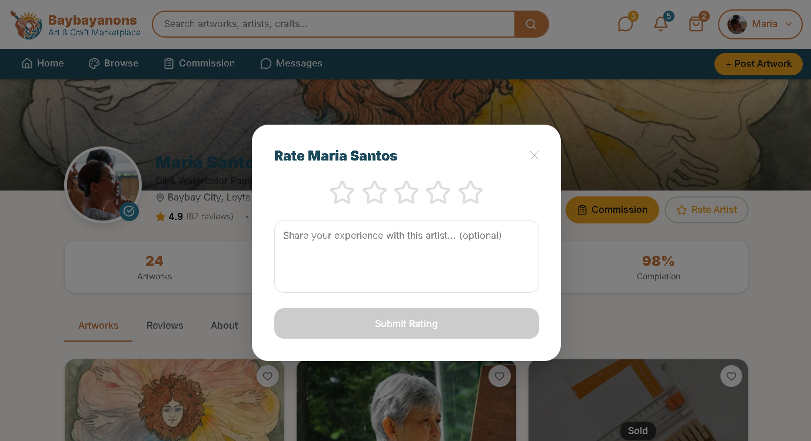
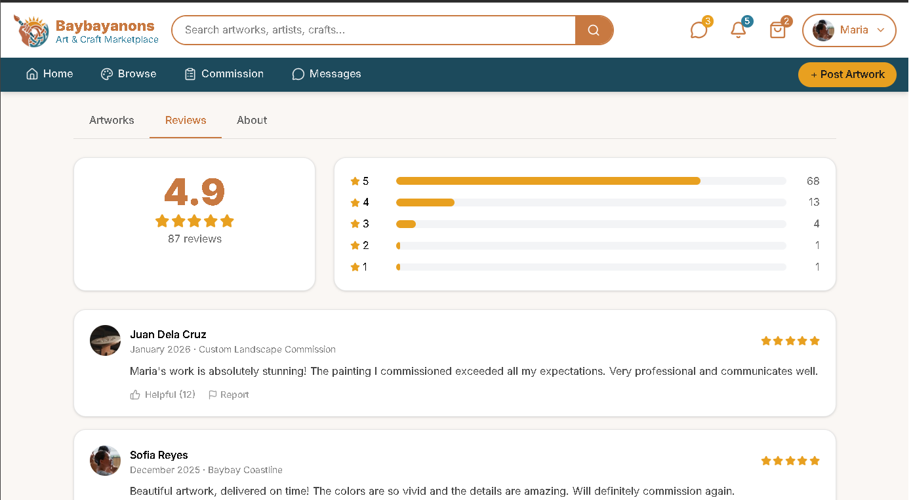

# Project Homepage > Artist Rating and Reviews

---

## Functional Description
The **Artist Rating and Reviews** module enables users to rate an artist's profile and leave reviews.
Key features include:
- Star rating and reviewing function.
- Rating and reviews display tab.
- Helpful marking and report buttons.
---

## Use Case Scenario

| Actor        | Action                                                                 | System Response                                      |
|--------------|------------------------------------------------------------------------|------------------------------------------------------|
| User         | Clicks the Rate Artis button on an artist profile page                 | System displays a pop-up for Star rating and reviewing function                |
| User         | Clicks the Submit Rating button                                        | System saves the rating and reviews in the artist's profile page   |
| User         | Clicks the Reviews tab                                                 | System displays the ratings and review tab of the artists containing the average star rating recieves and reviews left by other users   |
| User         | Clicks the Helpful button                                              | System marks the review as helpful and increases the helpful count   |
| User         | Clicks the Report button                                               | System sends a report for further review from the admins containing information on the report such as why it is reported   |

---

[← Back to Project Homepage](project-homepage.md)

© 2026 Arktic
