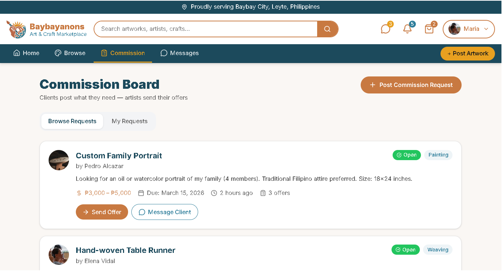
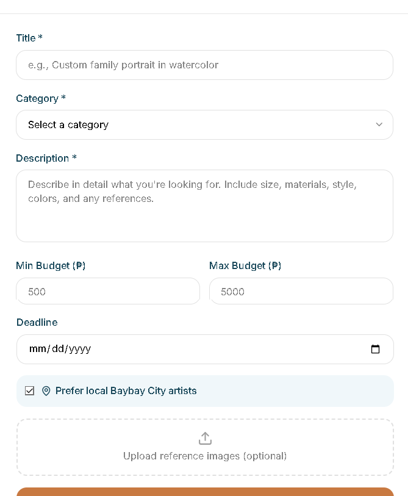

# Project Homepage > Commission Request Posting

---

## Functional Description
The **Commission Request Posting** module enables clients to a commission request on the commision board and for artist to be able to offer their services or to further talk about the request privately.
Key features include:
- Commission Request Post creation and management.
- Browsing the commission board starting from the most recent post.
- Offer or message client options
---

## Use Case Scenario

| Actor        | Action                                                                 | System Response                                      |
|--------------|------------------------------------------------------------------------|------------------------------------------------------|
| User         | Clicks the +Post Commission Request button                             | System displays commission request post creation pop-up                   |
| User         | Clicks the Post Commission button                                      | System saves the post and makes in available in the commission board      |
| User         | Clicks the Offer button                                                | System asks for offer details before sending the offer to client          |
| User         | Clicks the Message Client button                                       | System directs user to the secure messaging system and creates a convo with the client  |

---

[← Back to Project Homepage](project-homepage.md)

© 2026 Arktic
