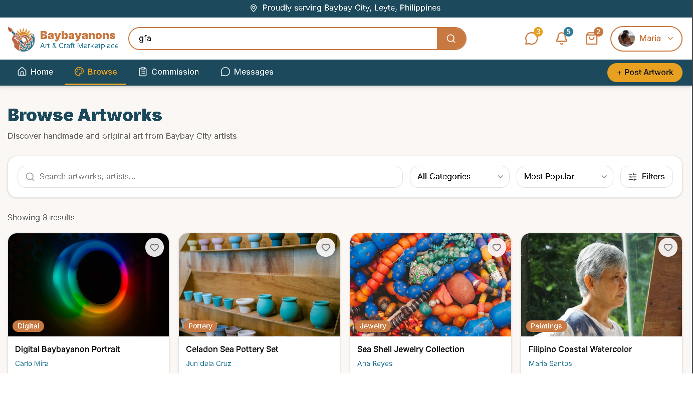

# Project Homepage > Search and Filtering

---

## Functional Description
The **Search and Filtering** module enables users to search and filter for the product or artist that match what they might like or need.  
Key features include:
- Fully functional search mechanism.
- Filter tags for different categories (eg. art style, art type, pricing, etc).
---

## Use Case Scenario

| Actor        | Action                                                                 | System Response                                      |
|--------------|------------------------------------------------------------------------|------------------------------------------------------|
| User         | Types in the search bar and presses enter                              | System directs user to the search result page        |
| User         | Selects from the available filtering options                           | System filters the results accordingly               |
| User         | Hovers over on of the results                                          | System displays a popup containing additional info   |
| User         | Selects one of the results                                             | System directs user to the page containing more info |

---

[← Back to Project Homepage](project-homepage.md)

© 2026 Arktic
