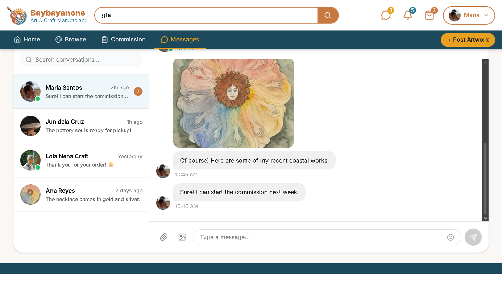

# Project Homepage > Secure Messaging System

---

## Functional Description
The **Secure Messaging System** module enables users to send and recieve messages from and to other users (client/artist).
Key features include:
- Send messages to a different user that may include attached files(eg. photos, videos).
- Recieve messages from a different user that may include attached files(eg. photos, videos).
- Call other users using video or audio inputs.
- Accept or reject call connection from other users.
- Secured system for privacy protection of all existing conversations.
---

## Use Case Scenario

| Actor        | Action                                                                 | System Response                                      |
|--------------|------------------------------------------------------------------------|------------------------------------------------------|
| User         | Types in the search bar and presses enter                              | System displays user profile results                 |
| User         | Selects from the available user options on the list                    | System displays the existing conversation with user  |
| User         | Types in chat box and presses send                                     | System sends and displays the message on the converstion  |
| User         | Clicks the attach file button                                          | System directs user to the page to select file to send  |
| User         | Clicks the voice or video call button                                  | System attempts to connect to other user  |
| System       | Called user accepts the connection                                     | System displays the call page with video and audio inputs if available  |

---

[← Back to Project Homepage](project-homepage.md)

© 2026 Arktic
