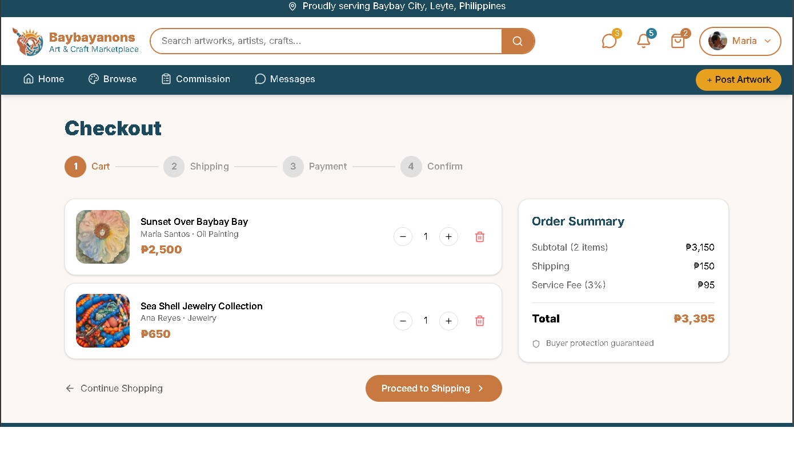
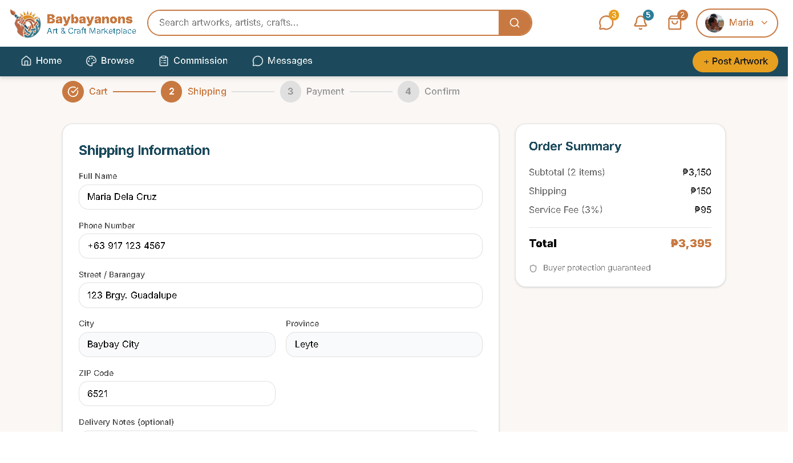
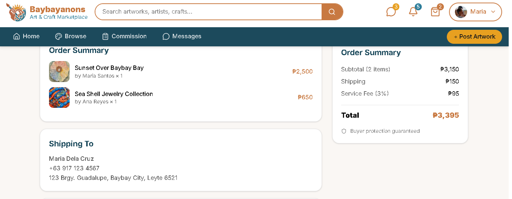

# Project Homepage > Secure Payment Integration

---

## Functional Description
The **Secure Payment Integration** module enables users to securely manage the payments they recieve or send through various channels and method
Key features include:
- Fully functioning checkout management page.
- Complete information gathering necessary for payment and delivery.
- Secure cooperation with legit local payment channels.
---

## Use Case Scenario

| Actor        | Action                                                                 | System Response                                      |
|--------------|------------------------------------------------------------------------|------------------------------------------------------|
| User         | Clicks the cart icon                                                   | System displays cart list                            |
| User         | Selects from the available user options on the list and clicks proceed | System displays shipping information tab user to fill out necessary information  |
| User         | Types in their necessary personal info in the text box                 | System checks the validation of certain info such as location and number         |
| User         | Clicks the proceed to Payment button                                   | System displays payment methods and channels available                           |
| User         | Selects payment method and fills  up necessary information             | System checks the validity of provided information                               |
| System       | Clicks the Review Order button                                         | System displays all of provided information and selected options for user verification  |
| System       | Clicks the Place Order button after checking the correctness of info   | System finalizes the orded and sents the info to the artist who owns the product   |

---

[← Back to Project Homepage](project-homepage.md)

© 2026 Arktic
