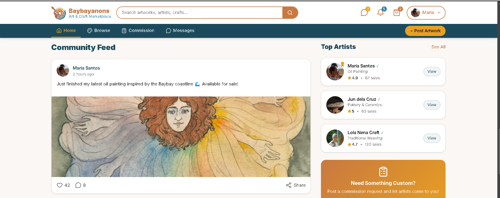
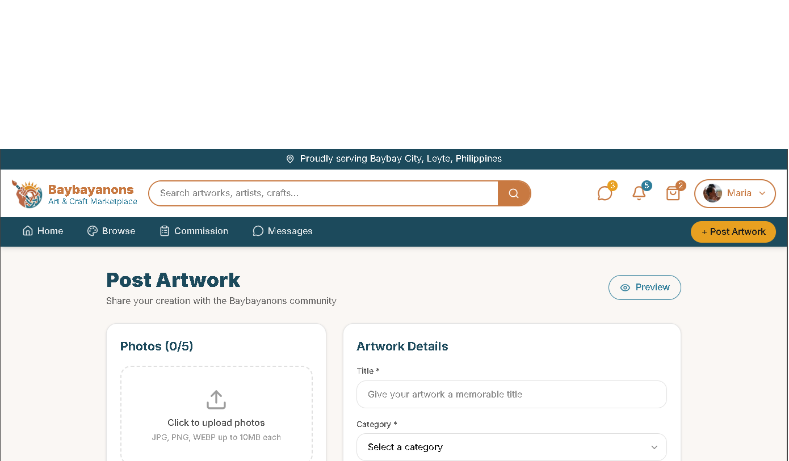
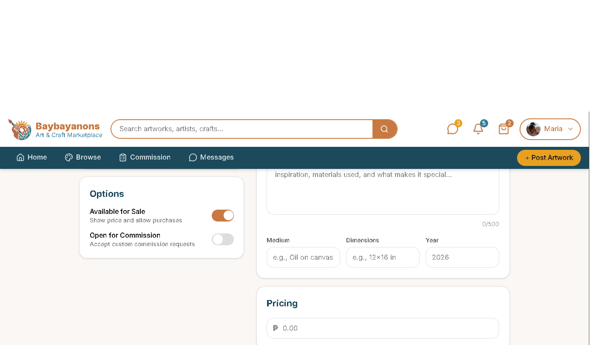

# Project Homepage > Social Feed and Interaction

---

## Functional Description
The **Social Feed and Interaction** module enables users to post artwork and interact with other post on the feed.
Key features include:
- Post creation and management.
- Browsing the community feed starting from the most recent post.
- Fully functioning react, comment, and share function on every post.
---

## Use Case Scenario

| Actor        | Action                                                                 | System Response                                      |
|--------------|------------------------------------------------------------------------|------------------------------------------------------|
| User         | Clicks the +Post Artwork button                                        | System displays post creation page                   |
| User         | Clicks the publish artwork button                                      | System saves the post and makes in available in the community feed   |
| User         | Clicks the heart shape button                                          | System marks the post as liked, increases the like count, and sends a notification    |
| User         | Clicks the comment button                                              | System displays all available comment on the post and a comment text box   |
| User         | Types in the comment text box and clicks the post button               | System posts the comment under the post and increases the comments count   |
| System       | Clicks the share button and confirms                                   | System creates a post under the user's account marked as shared post       |

---

[← Back to Project Homepage](project-homepage.md)

© 2026 Arktic
